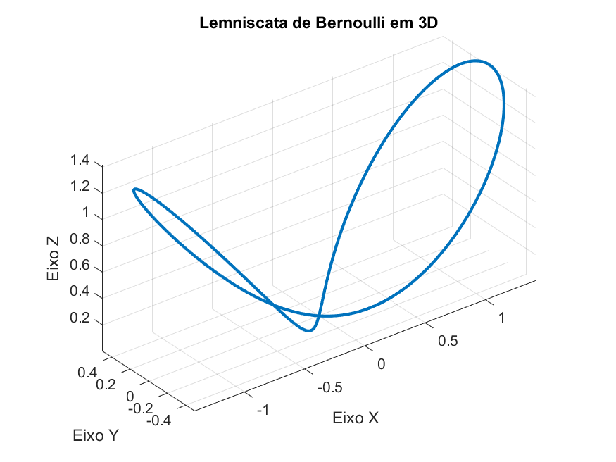

## 3D Simulation of the Bernoulli Lemniscate

**Description:**
This project involves a 3D simulation of the Bernoulli Lemniscate using MATLAB. The Bernoulli Lemniscate is a fascinating curve that takes the shape of the mathematical infinity symbol (∞). In this repository, you will find a MATLAB code that generates a visual representation of this curve in a three-dimensional (3D) space and saves the simulation as a PNG image.



## Bernoulli Lemniscate:
The Bernoulli Lemniscate is a remarkable mathematical curve discovered by Swiss mathematician Jacob Bernoulli (also known as James Bernoulli). It's often referred to as the "lemniscate" due to its characteristic shape resembling the infinity symbol (∞). The parametric equation of the Bernoulli Lemniscate in Cartesian coordinates is given by:

```
x = a * sqrt(2) * cos(theta) / (sin(theta)^2 + 1)
y = a * sqrt(2) * cos(theta) * sin(theta) / (sin(theta)^2 + 1)
z = a * sqrt(2) * cos(theta) * cos(theta) / (sin(theta)^2 + 1)
```

where `a` is an adjustable parameter and `theta` ranges from 0 to 2π.

## Using the Code:
The provided MATLAB code in this repository generates a 3D visualization of the Bernoulli Lemniscate and saves the simulation as a PNG image. The code begins by setting the parameters of the lemniscate and calculating the `x`, `y`, and `z` coordinates using the given parametric equations. It then creates a 3D plot using the `plot3` function and adjusts the settings for better visual output. The resulting graph displays the Bernoulli Lemniscate in 3D.

## Instructions:
1. Make sure you have MATLAB installed on your system.
2. Copy the provided code into a new MATLAB `.m` file.
3. Paste the code in the MATLAB file.
4. Run the `.m` file in MATLAB.
5. The code will generate a 3D graph of the Bernoulli Lemniscate and save the simulation as a PNG image named `bernoulli_leminiscate_3d.png` in the current MATLAB working directory.

## Note:
This project has been developed for educational and demonstration purposes only. Feel free to modify and adapt the code according to your needs and explore other MATLAB functionalities to enhance the simulation and visualization of the Bernoulli Lemniscate in 3D.
